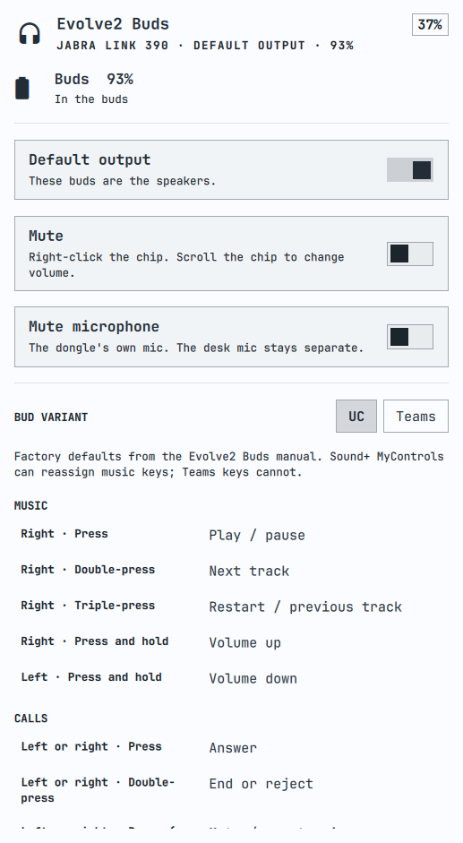

# Jabra Buds



A bar chip for [Jabra Evolve2 Buds](https://www.jabra.com/business/office-headsets/jabra-evolve2-buds) on a Link 390 USB dongle. Click it for charge, every factory tap, mute, and a switch that makes the dongle the default speakers.

This plugin is unofficial and is not affiliated with Jabra or GN Audio.

The buds handle Active Noise Cancellation themselves. On UC firmware, a press on the left bud cycles HearThrough and ANC. This plugin cannot flip that from the desktop — the dongle does not expose a safe ANC switch — but it does show the shortcut in the list, and it lights the matching row when a tap reaches Linux as a media key.

Charge sits at the top of the panel. That reading uses the same vendor HID channel as Jabra Direct. Tap **Grant HID access** once if the row says it needs it; that installs a udev rule so your user can open the dongle's hidraw node.

## Install

```sh
omarchy plugin add https://github.com/matt-shearing/omarchy-jabra.git --enable
omarchy bar move contra.jabra --before omarchy.audio
```

That clones the plugin and can place the chip on the right of the bar. The second command puts it next to Audio.

Needs Python 3, `python-evdev`, and `pactl`. Those ship with Omarchy. You should also be in the `input` group so tap highlighting can read the dongle's media keys.

## Use

- **Click** — open the panel: charge, output, mute, the tap list
- **Right-click** — mute the Jabra sink
- **Middle-click** — make the dongle the default output
- **Scroll** — volume on the Jabra sink

Pick **UC** or **Teams** at the top of the list. Those are two factory maps; Sound+ MyControls can reassign music keys. Teams keys cannot.

**Grant HID access** raises a password prompt (`pkexec`) and writes `/etc/udev/rules.d/99-jabra-hid.rules`. Unplug and replug the dongle if hidraw is still `Permission denied`. Volume, mute, and the tap list work without that grant. Charge does not.

The dongle microphone is a separate PipeWire source from any desk mic. HID access does not change how audio is routed.

## What it talks to

| Path | What |
|---|---|
| sysfs USB `idVendor=0b0e` | Dongle present |
| `pactl` | Volume, mute, default sink |
| `/dev/input/event*` (group `input`) | Last media-key tap, for highlighting the list |
| hidraw | Charge. A udev rule in `udev/` lets the helper open the vendor HID node |

The helper speaks Jabra's GN protocol on HID report 5, the same layout [fwupd](https://github.com/fwupd/fwupd) uses for these dongles. The headset is address `0x04` behind the Link 390.

## Command line

```sh
omarchy-shell shell toggle contra.jabra
~/.config/omarchy/plugins/contra.jabra/bin/jabra-ctl status
~/.config/omarchy/plugins/contra.jabra/bin/jabra-ctl watch
```

## Requirements

- Omarchy with third-party shell plugins
- A Jabra Link 390 (USB-A or USB-C) with Evolve2 Buds paired to it
- Python 3, `python-evdev`, PipeWire/`pactl`

Link 380 is recognised as the same family. Other Jabra USB headsets may show volume and mute if they appear as a Jabra Pulse sink; charge and the Evolve2 tap list are written for this dongle and these buds.

## Remove

```sh
omarchy plugin remove contra.jabra
```

That takes the chip off the bar. It does not touch PipeWire. The udev rule, if you granted HID access, stays until you delete `/etc/udev/rules.d/99-jabra-hid.rules` and reload udev.

## Development

From this checkout:

```sh
ln -sfn "$(pwd)" ~/.config/omarchy/plugins/contra.jabra
omarchy plugin validate .
omarchy plugin enable contra.jabra --section right --yes
omarchy bar move contra.jabra --before omarchy.audio
omarchy restart shell
python3 tests/test_ctl.py
```

## License

MIT. See [LICENSE](LICENSE).
